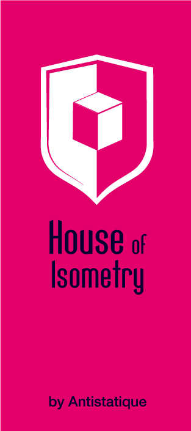

# House of Isometry
House of Isometry is a jQuery plugin that help to create a building in a 3d isometric projection from basic DOM element, all positioned in absolute.
You can navigate through an exploded view of the rooms which are all interactive. They will give you some more information about them & their content.



This is a project made with ♥️  by Antistatique a Swiss web agency based in Lausanne for one of our client. The amazing illustration are from Philippe Mignotte

## Use the library
- Clone the project

- Embed a version of jQuery
```
<script src="https://code.jquery.com/jquery-3.2.0.min.js" integrity="sha256-JAW99MJVpJBGcbzEuXk4Az05s/XyDdBomFqNlM3ic+I=" crossorigin="anonymous"></script>
```
- Include the following assets in your project :
```
<link rel="stylesheet" type="text/css" href="house-of-isometry.css">
<script src="house-of-isometry.bundle.js"></script>
```
- You can then initalize the plugin with:
```
var isometricLayout = new IsometricGrid($('.isometric-layout'), 200, 82, 30);
```


## Methods
### showExpandedView()
Show the expanded view of the grid
```
  isometricLayout.showExpandedView();
```
### showHomeView()
Show the home view of the grid
```
  isometricLayout.showHomeView();
```

### reCenter()
Relayout the grid. Usefull when you resize the viewport.
$(window).resize(function() {
  isometricLayout.reCenter();
});
## Build the library
### Javascript

To build your own distribution need the following NPM

Then you need to install all the npm dependencies
```
$ npm install
```
or (when using yarn)
```
$ yarn
```
You can now use the following command
```
$ npm run build
$ npm run watch
```
or more specifically
```
$ npm run build-js
$ npm run build-css
$ npm run watch-js
$ npm run watch-css
```

The sources are situated in `/src`.